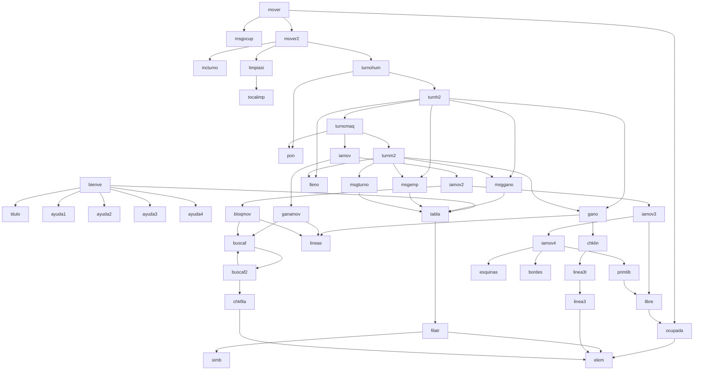

# tresia.lsp — Tic-Tac-Toe AI in MyLISP

Tic-Tac-Toe playable from the command line of **MyLISP**, a homebrew LISP interpreter for the Sinclair QL (dfsantos, 2026). You play against the computer, which responds using a fixed strategy (without random numbers, since the interpreter lacks a random generator).

## How to play

```lisp
(load "tresia.lsp")
```

Upon loading, a welcome screen automatically appears with instructions and an empty board. Positions are numbered as follows:

```
1 2 3
4 5 6
7 8 9
```

You are always player **X** (internal position 1), and the machine is always **O** (internal position 2). You play by calling `mover` with your chosen cell — the computer responds automatically in the same turn:

```lisp
(mover 5)
(mover 1)
(mover 9)
```

To restart at any time:

```lisp
(reset)
```

## Requirements

- A Sinclair QL (or emulator) running `MyLISP`
- The `tresia.lsp` file transferred to the QL filesystem

## Computer strategy

Since there is no way to generate random numbers, the machine plays using fixed rules in this priority order:

1. If it can win on this turn, it wins.
2. Otherwise, it blocks the player's winning move.
3. Otherwise, it takes the center (position 5) if open.
4. Otherwise, it takes the first available corner (1, 3, 7, or 9).
5. Otherwise, it takes the first available edge (2, 4, 6, or 8).

With optimal play, you cannot beat it — at best, you will draw.

## How it is built

The board is represented as a **list of 9 numbers** (`0`=empty, `1`=player, `2`=computer), without using any arrays or mutable data structures — every move generates a new list. The current state is saved in a global variable (`tablero`) via `DEFINE`, which in `MyLISP` allows global reassignments even from inside a function — preventing the player from having to manually pass the board state between turns.

Building this helped identify several real limitations of the interpreter, which had to be worked around in the design:

- **Symbol names longer than 8 characters corrupt memory.** All functions in this file stay within that limit.
- **Too much logic inside a single function also corrupts memory** (many `COND` clauses containing multiple steps each). The workaround was splitting everything into small, interconnected functions rather than concentrating logic.
- **Memory is not automatically reclaimed between commands.** A turn counter was added to invoke `(clean)` automatically every two turns.
- **Deeply nested `OR`/`AND` conditions inside a recursive function corrupt memory.** Winning line detection avoids this pattern by using `COND` instead.

## Function reference

### Board management
| Function | Description |
|---|---|
| `elem k lst` | Returns the element at index `k` of a list (recursive, via `cdr`) |
| `pon k v lst` | Returns a new list with value `v` set at position `k` |
| `simb v` | Translates a cell value (0/1/2) into its display symbol (`-`/`X`/`O`) |
| `filatr lst p` | Prints a row of 3 cells starting from position `p` |
| `tabla lst` | Prints the complete board (3 calls to `filatr`) |
| `ocupada lst p` | Is cell `p` already occupied? |
| `libre lst p` | Opposite of `ocupada` |
| `inicio` | Returns an empty board (9 zeros) |

### Win and draw detection
| Function | Description |
|---|---|
| `lineas` | Returns the 8 possible winning combinations |
| `linea3 lst a b c` | Do the 3 given positions hold the same non-empty value? |
| `linea3t lst tri` | Same as `linea3`, but receives the triplet as a list |
| `chklin lst lns` | Iterates through lines searching for a winning match |
| `gano lst` | Is there a winner on the board? |
| `lleno lst` | Are all 9 cells filled? (draw) |

### Computer strategy
| Function | Description |
|---|---|
| `chkfila lst j a b c` | If 2 of 3 cells belong to player `j` and the third is empty, returns that position |
| `buscaf` / `buscaf2` | Traverses all 8 lines applying `chkfila` until a move is found |
| `ganamov lst` | Position where the computer can win immediately (0 if none) |
| `bloqmov lst` | Position where the opponent must be blocked |
| `primlib lst lns` | First open position from a list of candidates |
| `esquinas` / `bordes` | Static lists of corner/edge positions |
| `iamov` → `iamov2` → `iamov3` → `iamov4` | Machine decision chain prioritized by strategy (win → block → center → corner → edge) |

### Messaging
| Function | Description |
|---|---|
| `msgocup lst` | Cell occupied error message |
| `msggano nuevo j` | Victory message (renders final board) |
| `msgemp nuevo` | Draw message (renders final board) |
| `msgturno` | Displays the board and announces it's your turn |

### Turn flow & memory management
| Function | Description |
|---|---|
| `turnohum p` | Applies player move and proceeds to check outcome |
| `turnh2` | Did player win? Draw? If neither, machine's turn |
| `turnomaq` | Applies machine move (`iamov`) |
| `turnm2` | Did machine win? Draw? If neither, prompts next turn |
| `mover p` | Entry point: validates cell and triggers `mover2` |
| `mover2 p` | Increments turn counter, executes move, cleans memory if due |
| `incturno` | Adds 1 to the global turn counter |
| `tocalimp` | Is it an even turn? (time to run garbage collection) |
| `limpiasi` | Calls `(clean)` if `tocalimp` returns true |
| `reset` | Resets board state and turn counter |

### Welcome screen
| Function | Description |
|---|---|
| `titulo` | Prints decorated header |
| `ayuda1` … `ayuda4` | Instructions split into small blocks |
| `bienve` | Combines title + instructions + initial board (runs automatically upon loading) |

## Call graph between functions



## Known limitations of MyLISP

Documented while working with the interpreter during development:

- Symbol names: **maximum 8 characters** (longer names corrupt memory)
- Global symbol table: **256 maximum** (starts with ~49 already reserved by the system)
- String table: **64 maximum** per session
- Dynamic Heap: **~24 KB** total
- `(clean)` reclaims the heap, but **not** the symbol/string tables (requires a hard reset)
- `OR`/`AND` conditions nested 3+ levels deep inside recursive functions corrupt memory
- `(status)` displays current usage across all 4 tables (Heap, Symbols, Strings, Reals)

## License

For MyLISP by dfsantos (2026), Sinclair QL.
