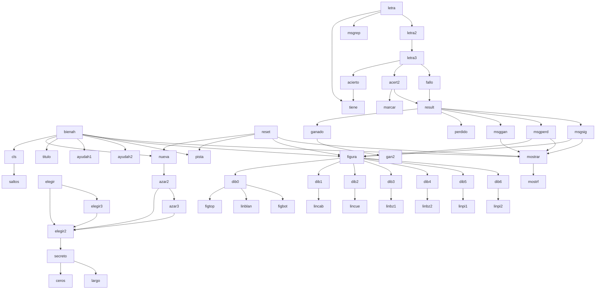

# ahorcado.lsp — Hangman in MyLISP

Classic Hangman playable from the **MyLISP** command line, the homebrew interpreter for the Sinclair QL. The machine picks the word on its own (using pseudo-random selection, since the interpreter lacks a random number generator), shows a category hint, and draws the classic stick figure in stages as you make mistakes.

## How to play

```lisp
(load "ahorcado")
```

Upon loading, the screen clears, a word is chosen automatically, and the title, instructions, hint, and initial board with dashes are displayed.

You propose letters like this, **without quotes**:

```lisp
(letra a)
(letra e)
(letra o)
```

For a new word at any time:

```lisp
(reset)
```

You can also pick the word yourself instead of letting the machine choose it:

```lisp
(elegir 'gato)
```

or enter your own custom word as a list of letters (symbols, without quotes):

```lisp
(secreto '(f e o))
```

### Note about the letter `ñ`

**The `ñ` is not a valid character** for this game (nor in general for symbol names in `MyLISP`). If you try to manually build a word containing `ñ` via `secreto`, it will not work — use only the alphabet without `ñ`.

## Predefined words

12 animals, each with its category (hint):

| "Domestic animal" Category | "Wild animal" Category |
|---|---|
| gato, perro, vaca, pato, oveja, cabra | leon, lince, oso, lobo, zorro, aguila |

## How it is built

### Representing the word

Each word is a **list of symbols**, one per letter — for instance, `gato` is `'(g a t o)`. Symbols are used instead of strings on purpose: the interpreter has a much smaller string table (around 50–64 total for the *entire* session) compared to its symbol table (200). Storing letters as symbols leaves significantly more memory headroom to play multiple consecutive games without exhausting the table.

Every letter of the alphabet (except `t`, for the reason explained below) is defined as a global variable that evaluates to itself (`(define a 'a)`, etc.), allowing you to type `(letra a)` instead of `(letra 'a)`.

### Game state

All game state is stored in global variables, reassigned using `DEFINE` from inside functions — the exact same technique used in `tresia.lsp` (Tic-Tac-Toe): `palabra` (the list of letters), `revel` (which positions have been revealed, a parallel 0/1 list), `errores` (how many misses), `usadas` (letters already tried), and `categ` (the current hint).

### Word selection

Lacking a random generator, `nueva` uses a counter (`turnoaz`) that increments with each game and selects the word based on the remainder of dividing that counter by 12 — it isn't true randomness, but it varies every time you play instead of repeating the same word.

### Drawing the hangman

Each line of the drawing (head, arms, legs, etc.) is its own small function (`lincab`, `linbz1`, `linbz2`, ...), and the 7 stages (`dib0` through `dib6`) simply combine those lines. This isn't just for neatness: the interpreter **does not reuse identical strings** that appear repeatedly in the code — each occurrence consumes its own slot in the string table. Writing each line only once (in its own function) and calling it multiple times from different stages avoids exhausting the table all at once.

### Categories

For the exact same reason, `"animal salvaje"` and `"animal casero"` are also each placed in their own function (`salvaje`, `casero`) rather than being written separately 12 times (once per word) — doing the latter would have consumed 24 string table slots right out of the gate.

## MyLISP bugs found while building this

- **A backslash followed by a quote (`"`) inside a string breaks the reader** with a "lexical error". A standalone backslash without an adjacent quote causes **no** issues (confirmed in gameplay — the hangman drawing uses `\` for an arm and a leg without trouble).
- **The interpreter does not reuse duplicate strings**: each literal occurrence of the same text in code consumes its own slot in the string table (which is already small, ~50–64 total). Repeating the same message many times in code can exhaust it sooner than expected, even without heavy gameplay.
- **`T` (uppercase or lowercase) is the reserved "true" symbol** across the entire interpreter — redefining it as your own variable risks breaking any `COND` depending on it in any program loaded in the session.

## Function reference

### Generic utilities
| Function | Description |
|---|---|
| `elem k lst` | Element at position `k` of a list |
| `ceros n` | List of `n` zeros |
| `largo lst` | Length of a list |
| `tiene x lst` | Is `x` in the list? |
| `saltos n` / `cls` | "Clear" screen by pushing content down with blank lines |

### Word and category
| Function | Description |
|---|---|
| `gato` … `cabra` | The 12 predefined words as lists of letters |
| `salvaje` / `casero` | The two category strings |
| `secreto pal` | Starts a game with the given list of letters |
| `elegir2 pal cat` | Starts the game and saves the category |
| `elegir nom` / `elegir3 nom` | Pick a predefined word by name |
| `azar2 i` / `azar3 i` | Pick a predefined word by index (0–11) |
| `nueva` | Advances the counter and picks the next word |
| `reset` | Start over with a different word |

### Drawing
| Function | Description |
|---|---|
| `figtop` / `figbot` | Static top/bottom lines of the gallows |
| `linblan` `lincab` `lincue` `linbz1` `linbz2` `linpi1` `linpi2` | Each possible body line, declared once each |
| `dib0` … `dib6` | The 7 stages, combining the lines above |
| `figura` | Chooses which stage to display based on `errores` |

### Game logic
| Function | Description |
|---|---|
| `pista` | Displays the current category |
| `mostrf` / `mostrar` | Prints the word with dashes for unrevealed letters |
| `marcar letr pal rev` | New `revel` list marking where the letter appears |
| `acierto letr` | Does the word contain this letter? |
| `gan2` / `ganado` | Have all letters been revealed? |
| `perdido` | Has the player reached 6 errors? |
| `msgrep` `msggan` `msgperd` `msgsig` | The 4 possible messages, each kept small |
| `result` | Decides which of the 4 messages to display |
| `acert2` / `fallo` | Apply a hit or miss, then call `result` |
| `letra3` / `letra2` / `letra` | Entry point: validates, applies, and resolves |

### Welcome screen
| Function | Description |
|---|---|
| `titulo` | Decorated title |
| `ayudah1` / `ayudah2` | Instructions |
| `bienah` | Bundles everything (runs automatically upon loading) |

## Call graph between functions



## License

For MyLISP by dfsantos (2026), Sinclair QL.
