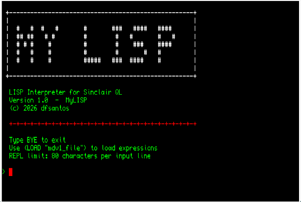

# MyLISP for Sinclair QL (v1.0)

MyLISP is a LISP-1 interpreter designed specifically to run on Sinclair QL computers and compatible emulators. 

## 💻 System Requirements & Quick Start

* **Memory:** Requires a minimum of 640KB RAM.
* **Dependencies:** Running the standalone executables requires the Prospero Pascal run-time library (`PRL` file) to be present on your system.
* **Ready-to-run Microdrive:** For maximum convenience, I have included a ready-to-use Microdrive image (containing the executable, the required `PRL` file, and default configurations). You can mount this image in your emulator or real hardware and run the interpreter directly without manually gathering dependencies.

## 📂 Repository Structure

The repository is organized into the following directories:

* `/EN`: Contains the MyLISP executable and the reference manual in English.
* `/ES`: Contains the MyLISP executable and the reference manual in Spanish.
* `/examples`: A collection of LISP programs to run on the interpreter.
* `/lang-templates`: Contains the base text files (`msg_EN.pas` and `msg_ES.pas`) required for localization.

*(Note: The bootable Microdrive image containing the full environment is located in the root of the repository).*

## 💡 Included Examples

Inside the `/examples` folder, you will find the following scripts to test the capabilities of the MyLISP interpreter:

* **`BASIC`**: A comprehensive test suite demonstrating the environment's fundamentals. It covers data types, list manipulation, flow control, classical recursive functions (like Fibonacci and Factorial), and controlled error handling to show the REPL's resilience.
* **`SORT`**: An implementation of the Selection Sort algorithm using recursive list processing and custom minimum-value extraction functions.
* **`DERIVA`**: A classic Lisp demonstration of symbolic computation. It acts as a symbolic differentiator, parsing mathematical expressions as trees and applying derivation rules alongside basic algebraic simplifications.
* **`ORDEN`**: A demonstration of functional programming concepts. It defines the higher-order paradigms `MAP`, `FILTER`, and `REDUCE` from scratch, applying them to custom predicates and arithmetic operations.

## 🚀 Usage and Distribution

MyLISP is **Freeware**. You can download, use, and freely distribute the binaries and manuals as long as they remain unmodified. 

**Note on source code:** This is a closed-source project. The source code for the interpreter engine is not published in this repository and is not available for download. 

## 🌍 Contribute: Translate MyLISP into another language

If you want MyLISP to be available in your native language, you can contribute by translating the system messages. Since the main source code is closed, the process is as follows:

1. Go to the `/lang-templates` folder and download one of the base files (for example, `msg_EN.pas`).
2. Edit the text strings inside the file with your translation. Please keep any variables and formatting characters intact.
3. Rename the file to indicate the target language (e.g., `msg_FR.pas` for French, `msg_IT.pas` for Italian).
4. Open an **Issue** in this repository and attach your file, or submit a **Pull Request** adding it to the `/lang-templates` folder.
5. Once reviewed, I will compile a new MyLISP binary with your translation, create a new language folder (e.g., `/FR`), and credit your work in this README.

## 📝 Changelog

* **v1.0 (Initial Release):** First public version. Includes interpreter core, base English/Spanish localizations, reference manuals, and foundational example scripts.

## 📜 License

* MyLISP binaries and documentation are Freeware. You may use them for any purpose, including commercial projects. However, the resale, repackaging, or direct monetization of the MyLISP software itself is strictly prohibited.
* The scripts and programs inside the `/examples` folder are in the public domain; you may use and modify them as you see fit.

*Disclaimer: This software was compiled using Prospero Pascal. The included `.PRL` run-time library is distributed solely to allow the execution of this program, following standard compiler runtime distribution practices. Prospero Pascal remains the copyright of Prospero Software / its respective owners.*
